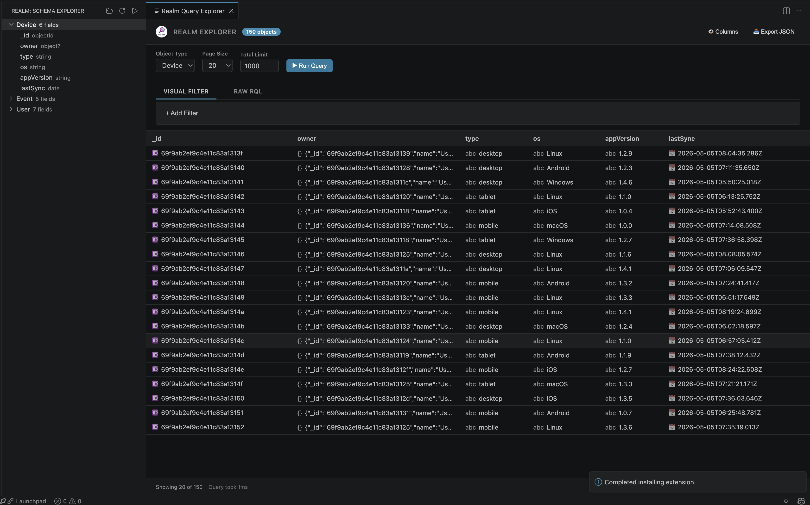

# Realm Explorer for VS Code

Inspect and query local Realm database files directly within VS Code with a powerful, modern UI.

## Features

### Schema Explorer

- View all object types in your Realm database
- Expand object types to see their properties and types
- Quick refresh to reload schema changes

### Advanced Query Interface

- **Visual Filter Builder**: Create filters using a user-friendly interface
  - Multiple filter conditions with AND/OR logic
  - Support for all comparison operators (equals, greater than, contains, etc.)
  - Field selection with auto-complete
- **Raw RQL Mode**: Write Realm Query Language queries directly for advanced filtering
- **Tabbed Interface**: Switch between visual and RQL modes seamlessly

### Query Execution

- **Run Query**: Execute queries and view paginated results
- **Count Only**: Get record counts without fetching data (faster for large datasets)
- **Smart Pagination**: Navigate through large result sets with page controls
- **Configurable Page Size**: Choose between 20, 50, 100, or 500 records per page

### Data Editing & Batch Updates

- **Always Editable**: Double-click any cell to edit data inline without needing to toggle an edit mode.
- **Batch Commits**: Edits are queued locally as pending changes. Apply or discard multiple changes simultaneously via the Pending Updates bar.
- **Add / Delete Rows**: Add new records using a dedicated modal with auto-generate capabilities for IDs/Dates, and delete rows directly from the table.
- **Visual Feedback**: Real-time visual indicators for pending changes and successful saves.

### Results Display

- **Sortable Columns**: Click column headers to sort results ascending/descending
- **Rich Table View**: Clean, responsive table with proper VSCode theme integration
- **Object Rendering**: Nested objects displayed as formatted JSON
- **Null Handling**: Clear indication of null values
- **Performance Metrics**: View execution time and record counts

### Data Export

- Export query results to JSON files
- Includes all fetched records with proper formatting
- Timestamped filenames for easy organization

### Modern UI

- Native VSCode theme integration (dark/light mode support)
- Responsive design that adapts to different panel sizes
- Loading states and error handling
- Status bar with real-time query statistics
- Badge showing total record count

## Usage

1. Click on the **Realm** icon in the Activity Bar (sidebar)
2. Click the **Open Realm File** button (folder icon) in the Schema Explorer title bar
3. Select a `.realm` file from your workspace
4. Explore the schema:
   - Expand object types to view their properties
   - See property types and optionality
5. Query your data:
   - Click the **Run Realm Query** button (play icon) or use the command palette
   - Choose an object type from the dropdown

### Visual Filter Builder

1. Select the "Visual Filter" tab
2. Choose a field from the dropdown
3. Select an operator (equals, contains, greater than, etc.)
4. Enter a value
5. Click "+ Add" to add more conditions with AND/OR logic
6. Click "Run Query" to execute

### Raw RQL Mode

1. Select the "Raw RQL" tab
2. Write your filter expression (e.g., `age > 20 AND name BEGINSWITH 'J'`)
3. Click "Run Query" to execute

### Additional Features

- **Count Only**: Get quick count without fetching data
- **Clear Results**: Reset the results view
- **Export JSON**: Save results to a JSON file
- **Pagination Controls**: Navigate with Previous/Next buttons or jump to a specific page
- **Sort Results**: Click any column header to sort

## Requirements

- This extension uses the `realm` Node.js package which contains native modules
- Compatible with macOS, Windows, and Linux
- VS Code version 1.80.0 or higher

## Extension Commands

- `Realm: Open Realm File` - Open a Realm database file
- `Realm: Run Query` - Open the query explorer panel
- `Realm: Refresh Schema` - Reload the schema tree view

## Tips

- Use the Count Only feature for quick data exploration without loading full result sets
- The visual filter builder automatically quotes string values
- Export functionality saves only the current page of results - adjust page size before exporting
- Sorting is performed client-side on the current page of results
- For complex queries, switch to Raw RQL mode for full Realm Query Language support

## Known Limitations

- Export saves only currently loaded page (not all matching records)
- Client-side sorting applies to current page only
- Very large objects may render slowly in the table view

## Future Enhancements

- Virtual scrolling for large result sets
- Server-side sorting
- Export all matching records (not just current page)
- Query history and saved queries
- Schema comparison between Realm files

## Keyboard Shortcuts

- `Cmd/Ctrl + Enter` in filter textarea: Execute query (coming soon)

## Support

For issues, feature requests, or contributions, please visit the GitHub repository.

---

**Enjoy exploring your Realm databases!**
